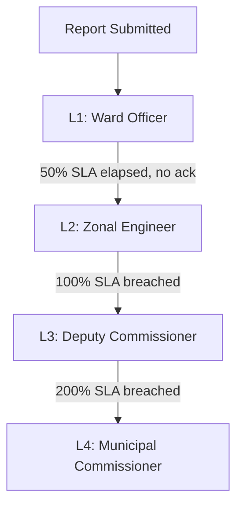

# CivicTrack — Data Privacy & Escalation Policy

> This document serves as the formal policy governing data protection, escalation procedures, and anti-harassment safeguards for the CivicTrack civic issue reporting platform. It is designed to comply with India's **Digital Personal Data Protection (DPDP) Act, 2023**.

---

## Part A: Data Privacy Policy

### A.1 Consent Framework

> [!IMPORTANT]
> All personal data processing requires **free, specific, informed, and unambiguous** consent from the citizen (DPDP Act Section 6).

| Principle | Implementation |
|---|---|
| **Explicit Consent** | A non-pre-checked toggle on the report wizard (Step 4). Submission is blocked until consent is actively given. |
| **Informed Consent** | A full privacy notice is displayed before the toggle, clearly stating what data is collected, why, who sees it, how long it's kept, and the right to withdraw. |
| **Granular Purpose** | Consent is tied specifically to "civic issue resolution." Data is not used for profiling, marketing, or any secondary purpose. |
| **Revocable** | Citizens can withdraw consent at any time via a "Delete My Data" request. Reports are anonymized (not deleted) to preserve civic records. |

### A.2 Data Collected

| Data Point | Source | Purpose | Shared With |
|---|---|---|---|
| Photo of issue | User upload | Evidence for ward officer | Ward officer, anonymized on public dashboard |
| GPS coordinates | EXIF extraction from photo | Auto-assign to correct ward | Ward officer, shown as map pin on public dashboard (no citizen link) |
| Issue title & description | User input | Context for resolution | Ward officer, public dashboard (anonymized) |
| Category selection | User input | SLA calculation, routing | Ward officer, public dashboard |
| Citizen identity (name, phone) | Auth profile | Contact for updates | **Ward officer ONLY for non-anonymous reports. NEVER on public dashboard.** |
| Submission timestamp | System-generated | Audit trail, SLA countdown | Ward officer, public dashboard |

### A.3 PII Isolation — Row Level Security (RLS)

The database enforces strict data isolation at the PostgreSQL level:

```
┌─────────────────────────────────────────────────────────────────┐
│  profiles table (PII: name, phone)                              │
│  ├── Citizens can read ONLY their own profile                   │
│  ├── Officers can see profiles ONLY for non-anonymous reports   │
│  │   in their assigned ward                                     │
│  └── Public users CANNOT access this table                      │
│                                                                 │
│  public_reports view (anonymized: NO citizen_id, NO phone)      │
│  └── Public users read from this view ONLY                      │
│                                                                 │
│  reports table (full data)                                      │
│  ├── Citizens can read ONLY their own reports                   │
│  ├── Officers can read reports in their assigned ward            │
│  └── Admins can read all reports                                │
└─────────────────────────────────────────────────────────────────┘
```

### A.4 Anonymization Rules

| Scenario | Citizen Identity Visible To |
|---|---|
| Non-anonymous report | Ward officer only (masked on public dashboard) |
| Anonymous report | **Nobody** — not even the ward officer |
| Public dashboard | **Always anonymized** — shows only issue details, location, and status |
| Photo display | Faces and license plates auto-blurred via Cloudinary AI (planned) |

### A.5 Data Retention & Right to Erasure

| Data Type | Retention Period | After Expiry |
|---|---|---|
| Report content (title, description, photo) | 2 years post-resolution | Archived, then purged |
| PII (citizen name, phone) | 6 months post-resolution | **Purged** — fields set to NULL |
| Audit logs (status changes) | Indefinite (for accountability) | Retained — no PII in audit logs |
| GPS coordinates | Same as report content | Retained as part of civic record |

> [!NOTE]
> **Right to Erasure**: Citizens can request deletion at any time. The system anonymizes the report (removes the citizen link) rather than deleting it, preserving the civic record while removing all personal association.

---

## Part B: Escalation Policy

### B.1 Escalation Tiers

The system uses a **4-tier automatic escalation** framework. No manual intervention is needed — the system monitors SLA deadlines and escalates automatically.



| Level | Role | Trigger | Action |
|---|---|---|---|
| **L1** | Ward Officer | Immediate (report submission) | Auto-assigned via GPS ward mapping. Push notification sent. |
| **L2** | Zonal Engineer | 50% of SLA elapsed without acknowledgment | Automatic escalation. Zonal Engineer receives alert + full report context. |
| **L3** | Deputy Commissioner | 100% of SLA breached (deadline passed) | Flagged in weekly review dashboard. Deputy Commissioner briefed. |
| **L4** | Municipal Commissioner | 200% of SLA breached (double the deadline) | Auto-included in Commissioner's daily brief. Red-flagged for immediate action. |

### B.2 SLA Matrix by Issue Category

| Category | SLA | Severity | Rationale |
|---|---|---|---|
| ⚠️ Open Manhole | **6 hours** | 🔴 Critical | Immediate life-safety hazard. Children and pedestrians at risk. |
| 🚰 Sewage Overflow | **12 hours** | 🔴 Critical | Public health emergency. Mosquito breeding, disease risk. |
| 💧 Water Supply | **12 hours** | 🟠 High | Essential service disruption. Families cannot cook or drink. |
| 💡 Streetlight Outage | **24 hours** | 🟠 High | Accident-prone zones at night. Women's safety concern. |
| 🗑️ Garbage Dump | **24 hours** | 🟠 High | Stray animal attraction, disease vector, visual blight. |
| 🕳️ Pothole | **48 hours** | 🔵 Medium | Vehicle damage, accident risk. Common but not immediately life-threatening. |
| 🔊 Noise Pollution | **48 hours** | 🔵 Medium | Quality of life. Requires coordination with pollution board. |
| 🛣️ Road Damage | **72 hours** | 🔵 Medium | Larger infrastructure repair. Requires PWD coordination. |
| 🏗️ Illegal Construction | **7 days** | ⚪ Low | Investigation required. Legal process involved. |

### B.3 SLA Urgency Indicators (UI)

The admin dashboard uses color-coded urgency indicators:

| Status | Time Remaining | Indicator |
|---|---|---|
| 🟢 Safe | > 24 hours | Blue left border |
| 🟡 Warning | 6–24 hours | Amber left border |
| 🟠 Critical | 0–6 hours | Orange left border |
| 🔴 Overdue | Past deadline | Red left border + pulsing red dot |

---

## Part C: Anti-Harassment & False Report Safeguards

### C.1 Preventing Harassment of Vendors / Minorities

> [!WARNING]
> This section addresses the specific risk of the platform being misused to target specific vendors, businesses, or minority communities.

| Safeguard | Mechanism |
|---|---|
| **Infrastructure-Only Categories** | All 9 issue categories are strictly infrastructure-based (potholes, lights, sewage). There are no "encroachment," "nuisance," or "vendor complaint" categories that could be weaponized. |
| **Anti-Targeting NLP Filter** | Report descriptions mentioning specific individuals, business names, caste names, or community identifiers are automatically flagged for moderator review before any public visibility. |
| **Anonymous Public Data** | The public dashboard shows *what* (the issue) and *where* (the location) — **never** *who reported*. This prevents retaliatory identification by the party being reported on. |
| **Location-Only Metadata** | The GPS coordinates captured are of the *issue location* (e.g., the pothole), NOT of the reporter's home or workplace. No personal location data is stored. |
| **Moderator Queue** | Flagged reports enter a review queue visible only to admin-role users. Ward officers do not see flagged reports until a moderator approves them, preventing biased handling. |

### C.2 Handling False Reports

| Safeguard | Mechanism |
|---|---|
| **Trust Score System** | Every citizen starts with a trust score of 50. Verified/resolved reports → +5. Rejected/false reports → -10. Users below 20 are placed in a manual moderation queue. |
| **EXIF Cross-Validation** | The photo's EXIF timestamp and GPS coordinates are compared against the submission time and reported location. Significant mismatches (e.g., photo taken 3 days ago or in a different city) flag the report as suspicious. |
| **Rate Limiting** | Citizens are limited to 5 reports per 24 hours. Burst submissions from a single user trigger a cooldown period and route all their reports to the moderation queue. |

### C.3 Handling Duplicate Reports

| Safeguard | Mechanism |
|---|---|
| **Spatial Deduplication** | When a citizen places a pin, the system queries for existing reports of the same category within a 100m radius submitted in the last 48 hours. If matches are found, the citizen is shown existing reports and encouraged to "upvote" instead. |
| **Officer Rejection Workflow** | Officers can reject reports with reason code "Duplicate" and reference the original ticket ID. This is logged in the immutable audit trail. |
| **Merge Capability (Planned)** | Admin users can merge duplicate tickets, combining upvotes and comments while retaining the original audit trail. |

---

## Part D: Success Metrics

| Metric | Target | Measurement Method |
|---|---|---|
| End-to-end report-to-resolution flow | ✅ Demonstrable | Full flow working in functional prototype |
| Usability rating | ≥ 8/10 | 10 test users from diverse age groups (planned) |
| DPDP compliance walkthrough | ✅ Clear & documented | Consent flow visible in UI + this policy document |
| Resolution rate | > 70% | Dashboard ward performance metrics |
| SLA compliance rate | > 90% | Dashboard SLA compliance metric |
| Mean time to acknowledge | < 4 hours | Audit log timestamps |
| False report rate | < 5% | Trust score + rejection tracking |

---

## Part E: Potential Impact

> A municipality-ready open-source civic tool — particularly valuable for **Tier-2/3 cities** that cannot afford bespoke platforms.

- **Open Source**: Free to deploy. Any municipality can self-host on Supabase + Vercel.
- **Bilingual Ready**: Architecture supports localization (Hindi, Tamil, etc.).
- **Low-Bandwidth Optimized**: PWA with offline-first photo capture (planned).
- **Data Sovereignty**: All data stays within the municipality's Supabase instance. No third-party data sharing.
